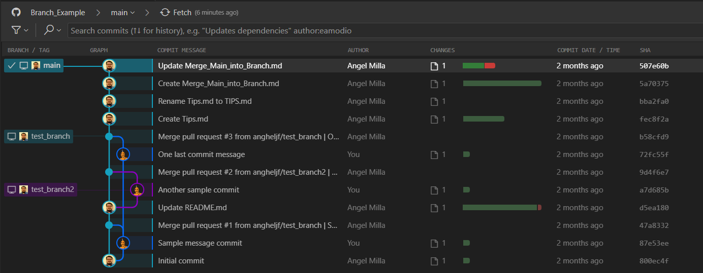

# Pushing Files to a Specific Branch with Git

This guide will walk you through the process of creating a local branch, making changes, and pushing the branch and its files to a remote repository using Git.

## Prerequisites

- Git is installed on your computer. You can download it from the official website: [https://git-scm.com/downloads](https://git-scm.com/downloads)

## Instructions

1. **Clone a repository (if not already done)**: If you haven't cloned a repository yet, you can do so by running the following command, where `<repository-url>` is the URL of the remote repository:
    ```
    git clone <repository-url>
    ```

2. **Create a new branch**: To create a new branch, run the following command, replacing `<branch-name>` with the desired name for your branch:
    ```
    git checkout -b <branch-name>
    ```

3. **Make changes and commit**: Copy or modify the files in your local repository as needed. Use the following command to stage all modified files:
    ```
    git add .
    ```
    Then, commit the changes with a descriptive message:
    ```
    git commit -m "Your commit message"
    ```

4. **Push the branch**: Finally, push your branch and its commits using the following command, replacing `<branch-name>` with the name of your branch:
    ```
    git push -u origin <branch-name>
    ```

That's it! Your branch and its associated files should now be pushed to the repository. You can continue making changes, committing them, and pushing them using the same branch.

Feel free to modify and adapt the commands to suit your specific needs and project structure.

If you have any questions or encounter any issues, please don't hesitate to ask for assistance.

**Example Branch Graph**:


